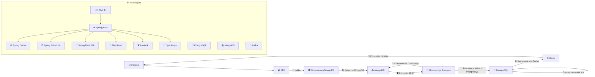

# ✨ Desafio Back-end - HexagonalArq

## 📅 Autor: Thiago Cavalcanti Batista  

## 🛠️ Escopo:  

Microserviços distribuídos para demonstrar fluxo e comunicação entre APIs. Os microserviços interagem via mensageria (Kafka) e persistem dados em **MongoDB**, **PostgreSQL** e **Redis** (Cache).  

---
## 📚 Tecnologias Utilizadas  

- 👨‍💻 **Linguagem:** Java 17  
- ☕ **Framework:** Spring Boot  
- 📃 **Banco de Dados:** PostgreSQL & MongoDB  
- 📢 **Mensageria:** Apache Kafka  
- 🛠️ **Ferramentas & Bibliotecas:**  
  - Spring Cache (caching de dados)  
  - Spring Scheduler (tarefas periódicas)  
  - Spring Data JPA (persistência)  
  - MapStruct (mapeamento de DTOs)  
  - Lombok (redução de boilerplate)  
  - Spring Cloud OpenFeign (comunicação entre serviços REST)  

---
## 🌍 Arquitetura  

📅 **Fluxo de Dados:**

1. 💻 O **microserviço BFF** recebe um objeto e salva no **MongoDB**.  
2. ✈️ Em seguida, ele envia o dado via **Kafka** para o **microserviço MongoDB**.  
3. 🏛️ O **microserviço MongoDB** persiste o dado no **MongoDB** e expõe um endpoint REST.  
4. 🧐 O **microserviço Postgres** consome os dados via **OpenFeign**, processa e armazena no **PostgreSQL**.  
5. 🔄 O dado salvo no **PostgreSQL** é armazenado em **cache (Redis)** para otimizar consultas futuras.  
6. ⏰ O **agendador** garante atualizações periódicas no banco a cada **30 segundos**.  

---
## ✅ Considerações Finais  

- 🎯 **Cache**: Evita consultas desnecessárias e melhora a performance.  
- ⏰ **Agendamento**: Atualiza o banco a cada **30 segundos**.  
- ⚖️ **Escalabilidade**: Kafka melhora o desacoplamento entre serviços.  
- 📄 **Logging**: Permite acompanhar processos e detectar erros rapidamente.  

🏠 **Sistema preparado para alta performance e escalabilidade!** 🚀

